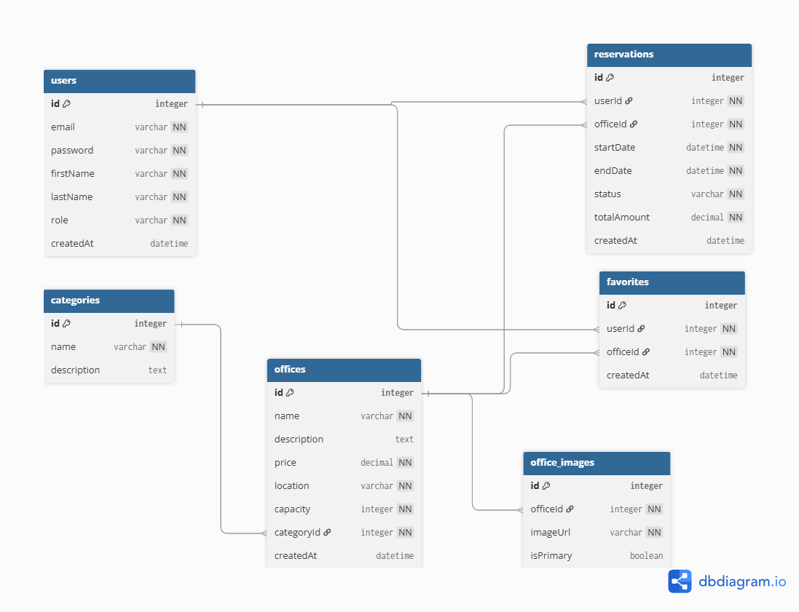

> Este repositorio contiene un ejemplo de documentación de un proyecto de arquitectura monolítica desacoplada, con frontend en React y backend en Java con Spring Boot, conectado a una base de datos MySQL.

# 🏢 Coworking App

Aplicación web para gestión de espacios de coworking. Permite a los usuarios registrarse, explorar oficinas disponibles, hacer reservas, y dejar favoritos. Admins pueden gestionar productos, categorías y servicios.

---

## ⚙️ Tecnologías

### 🖥️ Frontend
- React 18 + Vite
- Tailwind CSS
- Axios
- React Router

### ☕ Backend
- Java 17
- Spring Boot 3.2.x
- Spring Security + JWT
- Spring Data JPA
- MySQL
- Cloudinary (para imágenes)

---

## 🚀 Instalación local

### 🧩 Requisitos previos
- Node.js 18+
- Java 17+
- MySQL
- Docker (opcional)

### 📦 Cloná el repositorio
```bash
git clone https://github.com/usuario/coworking-app.git
cd coworking-app
```

---

### 📁 Backend (`/backend`)

```bash
cd backend
```

#### Configurar base de datos:
```sql
CREATE DATABASE coworking;
```
#### Configurar variables de entorno:
```bash
cd backend
touch .env
```
#### Archivo .env (Variables de entorno):
```dotenv
# .env
DB_URL=jdbc:mysql://localhost:3306/coworking
DB_USERNAME=root
DB_PASSWORD=123456
JWT_SECRET=clave_supersecreta
CLOUDINARY_CLOUD_NAME=nombre_cloud
CLOUDINARY_API_KEY=123456
CLOUDINARY_API_SECRET=clave
```
#### Correr el backend:
```bash
./mvnw spring-boot:run
```
> El Backend estará disponible en `http://localhost:8080`
---

### 🖼️ Frontend (`/frontend`)

```bash
cd frontend
npm install
```
#### Configurar variables de entorno:
```bash
cd frontend
touch .env
```
#### Archivo .env (Variables de entorno):
```dotenv
# .env
VITE_API_URL=http://localhost:8080/api
```
#### Correr el frontend:
```bash
npm run dev
```
> La aplicación estará disponible en `http://localhost:5173`
---

## 📬 Endpoints (API REST)

| Método | Endpoint                    | Descripción                           | Auth |
|--------|-----------------------------|---------------------------------------|------|
| POST   | /api/auth/register          | Registro de usuario                   | ❌   |
| POST   | /api/auth/login             | Login y generación de JWT             | ❌   |
| GET    | /api/offices                | Listado de oficinas                   | ❌   |
| POST   | /api/offices                | Crear oficina                         | ✅ (ADMIN) |
| GET    | /api/offices/{id}          | Detalle de oficina                    | ❌   |
| POST   | /api/reservations           | Crear reserva                         | ✅   |

> 📌 Swagger Docs disponible en: `http://localhost:8080/swagger-ui/index.html`

---

## 🗂️ Diagrama de Entidades (ER)



> Creado con [https://dbdiagram.io](https://dbdiagram.io)

---

## 🧪 Testing

### Backend
- Tests unitarios con JUnit y Mockito.
- Tests de integración con Testcontainers.

```bash
./mvnw test
```

### Frontend
- Testing con Vitest + React Testing Library

```bash
npm test
```

---

## ☁️ Deploy

### Backend:
- Railway (https://railway.app)

### Frontend:
- Vercel (https://vercel.com)

---

## 👤 Autores

- [@verovaldez](https://github.com/verovaldez)
- [@equipo-dev](https://github.com/equipo-dev)

---

## 📄 Licencia
MIT
---

## 📞 Soporte
¿Encontraste un bug o tienes una sugerencia?

- 🐛 Reportar bug
- 💡 Solicitar feature
- 📧 Email: soporte@coworkingapp.com
